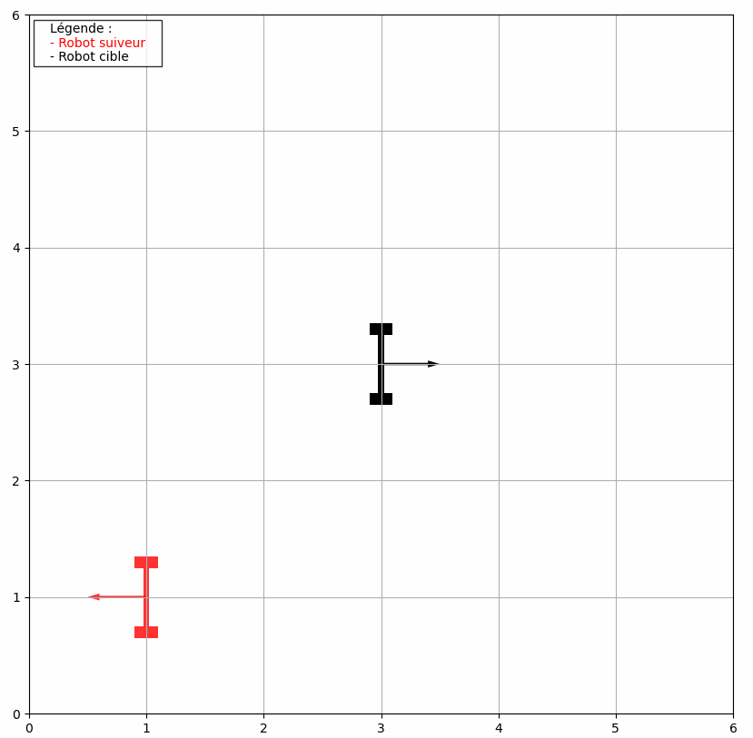

IRP - Poursuite d’une cible par un robot mobile à roue non holonome
=============

## A propos
Projet réalisé pour l'UE Projet en M1 ISTR-RODECO (Paul Sabatier, Toulouse) en 2019-2020 par le groupe étudiant suivant :

Alexandre MOUTARDE, Anthony THURIES, Rochedi LARBI, Yimtchen LY

## Installation des logiciels et des dépendances

* Télécharger [Visual Studio Code](https://code.visualstudio.com/download)
* Télécharger [Python 3.8](https://www.python.org/downloads/) minimum. A l'installation, faites installation recommandée et à la fin de l'installation, cliquez sur le bouton "add Python to path" et/ou "extend path limit"
* Télécharger le module python pip (si besoin)
* Télécharger la librairie graphique Matplotlib depuis un terminal : `pip install matplotlib`
* Ouvrir Visual Studio Code et télécharger l'extension `Python Linting, Debugging`

## Ouverture et exécution du programme

* Ouvrir le logiciel Visual Studio Code > File > Open folder... > Sélectionner le dossier du projet
* Ouvrir le fichier `simulmation.py`
* Exécuter la simulation en faisant un clic droit sur la fenêtre puis "Run File in Terminal" ou clic sur la flèche verte en haut à droite (si disponible)

## Paramètres du projet

Dans le fichier `simulation.py`, plusieurs paramètres sont modifiables :
* `Te = 0.005` (fréquence d'échantillonnage de la commande)
* `trace = True` : Affiche la trace des robots
* `save = True` : Génère un fichier "erreurs.txt" pour génère les courbes d'erreurs

### Classes du projet

* `Cible(x0, y0, theta0, ax, couleur, vmax, tacc, Te, pattern)`
* `Suiveur(x0, y0, theta0, ax, couleur, cible)`

### Arguments :
* `x0`, `y0` : coordonnées du robot (en m)
* `theta0` : orientation du robot (entre -180 et 180 degrés)
* `ax` : axes de la figure qui affiche le robot
* `couleur` : couleur du robot
* `vmax` : vitesse maximale
* `tacc` : temps d'accélération pour passer de 0 à vmax (idem pour déceleration)
* `Te` : période d'échantiollage
* `pattern` : trajectoire du robot (ligne / cercle / huit / random / custom / control)
* `cible` : identifiant de la cible à suivre

## Exemple de simulation

